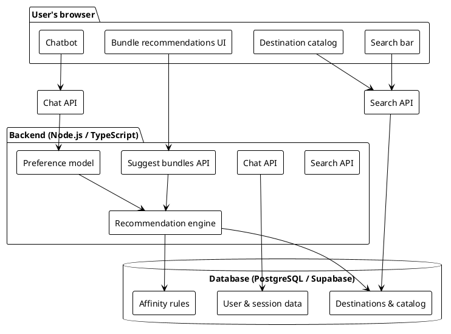
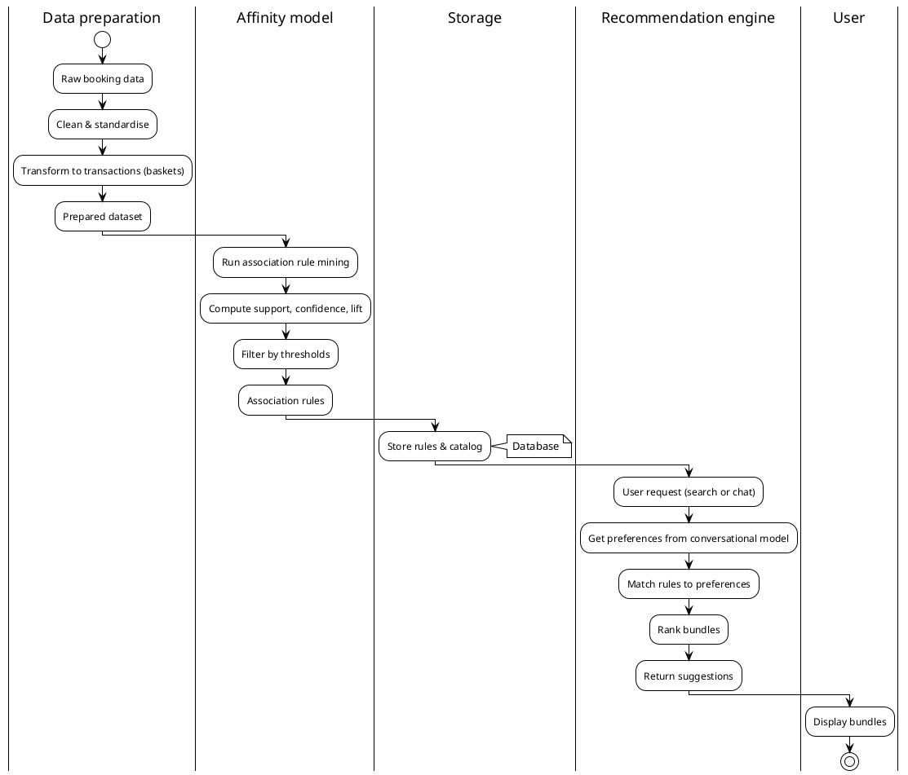
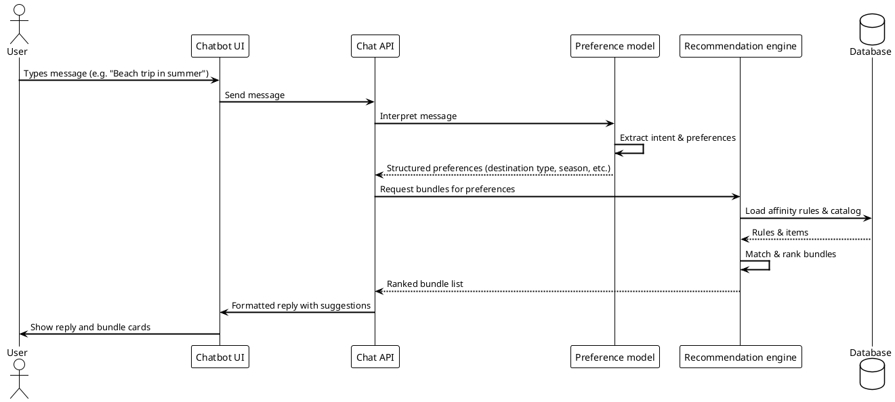
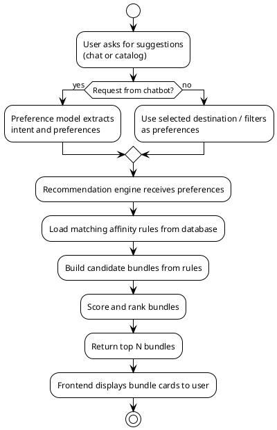

# Design

This chapter describes how the travel recommendation system is structured and how its main parts work together. It builds on the Analysis chapter by turning requirements and models into a concrete design: the overall architecture, how data moves through the system, how the affinity model and recommendation engine behave, how the chatbot and the user interact, and how the database and interface are organised. Where drawings are needed, PlantUML code is provided so you can generate the diagrams yourself.

---

## 1. Introduction to the Design

The design takes the building blocks from the Analysis—the affinity model, the conversational preference model, the recommendation engine, and the user-facing features—and arranges them into a system that is clear to build and to explain. The goal is a structure where each part has a well-defined role: the frontend handles what users see and do, the backend coordinates requests and applies the in-house models, and the database holds travel data and the results of affinity analysis. The following sections describe this structure step by step, with diagrams where they help.

---

## 2. System Architecture

The system is split into layers so that changes in one area (for example, the way bundles are ranked) do not force changes everywhere else. Users interact only with the web interface; the interface talks to a backend that runs the recommendation logic and the conversational model; and the backend reads and writes data through a database. Below is an overview of these layers, followed by a component diagram you can generate with PlantUML.

**Frontend (presentation layer).** The part the user sees and uses. It includes the search bar (with suggestions as you type), the destination catalog, the chatbot window, and the screens where recommended bundles are shown. This layer is built with React and runs in the browser. It does not run the affinity or preference models itself; it sends user input to the backend and displays the answers.

**Backend (application layer).** The server that receives requests from the frontend, calls the affinity model and the conversational preference model, and returns recommendations and chat replies. It exposes APIs for search, for chat, and for bundle suggestions. The recommendation engine lives here: it uses the rules produced by the affinity model and the preferences extracted by the conversational model to decide which bundles to suggest.

**Data layer.** The database stores destinations, activities, booking-related data, and the association rules (or their summaries) that the affinity model produces. The application reads from it to build suggestions and to personalise results. Storing rules and catalog data here keeps the system consistent and allows the recommendation engine to work without reprocessing raw data every time.

**PlantUML: System architecture (components)**

Use the following code to draw the high-level architecture. It shows the main components and who talks to whom.



*Figure 1: System architecture – frontend, backend, and data layer*

---

## 3. Data Flow Design

To understand how the system goes from raw booking data to personalised bundle suggestions, it helps to follow the data flow. Raw or preprocessed booking data is fed into the affinity model; the model produces association rules (with support, confidence, and lift). Those rules are stored and used by the recommendation engine. When a user asks for suggestions—via search or the chatbot—the engine uses the rules plus the user’s preferences to pick and rank bundles. The diagram below summarises this flow.

**PlantUML: Data flow (from raw data to recommendations)**



*Figure 2: Data flow from raw data to affinity model and recommendations*

---

## 4. Affinity Model and Recommendation Engine Design

The affinity model is the part that discovers which travel products tend to go together. It works on transactional data: each booking is a “basket” of items (destinations, activities, accommodations, etc.). The model finds frequent itemsets and turns them into rules of the form *X → Y*, with support, confidence, and lift. Rules that pass the chosen thresholds are kept and later used by the recommendation engine.

The recommendation engine does not re-run the affinity model on each request. Instead, it uses the rules already computed and stored. When a user asks for suggestions, the engine receives structured preferences (for example, destination type, budget, or activities of interest). It then selects rules whose antecedent or consequent match those preferences, scores the candidate bundles (for example by lift or confidence), and returns an ordered list. So the “intelligence” of the system comes from the affinity model’s rules; the engine is the component that applies those rules to each user in real time.

**Design choices.** Rules are stored so that the engine can query them quickly (e.g. by destination or category). The engine is designed to combine multiple rules when building a bundle (e.g. “destination A” often goes with “activity B” and “restaurant C”) so that suggestions feel coherent and data-driven.

---

## 5. Chatbot and Preference Flow

The chatbot is the main way users express what they want in natural language. The conversational preference model interprets each message: it identifies the user’s intent (e.g. “I want recommendations” or “I’m looking for a beach trip”) and pulls out concrete preferences such as destination, dates, budget, or activities. These structured preferences are then passed to the recommendation engine, which returns bundles; the chatbot turns the results back into a friendly reply.

The sequence of a typical “I want bundle recommendations” conversation is: user sends a message → backend receives it → preference model extracts intent and preferences → recommendation engine is called with those preferences → engine returns ranked bundles → backend formats a reply → user sees the reply and, if needed, can refine by typing again. The diagram below captures this interaction.

**PlantUML: Sequence diagram – chatbot-driven recommendation**



*Figure 3: Sequence diagram for chatbot-driven recommendation*

---

## 6. Database Design

The database holds the information the system needs to work: the travel catalog (destinations, activities, and related items), the outputs of the affinity model (rules or precomputed bundle data), and user-related data (e.g. profiles or session information for personalisation). The design favours simple, clear tables so that the backend can query quickly and the schema is easy to maintain.

**Main concepts.** *Catalog* tables describe what can be recommended: e.g. destinations, activities, restaurants, with names, categories, and any tags or attributes. *Affinity* or *rules* storage holds the association rules (or their identifiers and metrics) so the recommendation engine can filter and score by destination, category, or strength. *User* and *session* tables support login and storing preferences or history if the system uses them. The exact table names and columns depend on implementation; the idea is to keep catalog data, rule data, and user data separate so that each part of the system has a clear place to read and write.

**PlantUML: Entity overview (logical data model)**

The following diagram shows the main logical entities and how they relate. You can adapt table names to match your actual schema (e.g. Supabase tables).

```plantuml
@startuml Database_Design
!theme plain
skinparam backgroundColor white
skinparam classAttributeIconSize 0

class "Destination" <<entity>> as dest {
  * id : key
  --
  name : string
  category : string
  region : string
  tags : string[]
}

class "Activity" <<entity>> as act {
  * id : key
  --
  name : string
  category : string
  price : number
  tags : string[]
}

class "Association rule" <<entity>> as rule {
  * id : key
  --
  antecedent : items
  consequent : items
  support : number
  confidence : number
  lift : number
}

class "User / Session" <<entity>> as user {
  * id : key
  --
  preferences : json / text
}

dest "1" -- "n" rule : used in
act "1" -- "n" rule : used in
user "1" -- "0..n" rule : (e.g. history)
@enduml
```

*Figure 4: Logical data model – main entities*

---

## 7. User Interface Structure

The interface is organised so that users can search, browse the catalog, talk to the chatbot, and see bundle recommendations without switching between many different screens. The main areas are:

- **Home / landing.** Entry point with search and links to catalog and chatbot.
- **Search.** A bar that suggests destinations or activities as the user types; results can link to the catalog or to bundle suggestions.
- **Destination catalog.** Browsable list or grid of destinations (and possibly activities) with filters; selecting an item can show details and related bundles.
- **Chatbot.** A panel or page where the user types messages and receives replies with text and, when relevant, bundle cards or links.
- **Bundle recommendations.** Shown inside the chatbot or on a dedicated area; each bundle is presented as a small card (destination + activities + optional price or tags) so the user can compare and choose.

The frontend is built from reusable components (e.g. a search bar, a chat bubble, a bundle card) so that the same behaviour and look can be used in more than one place. This keeps the design consistent and easier to maintain.

---

## 8. Bundle Suggestion Flow (End-to-End)

When a user asks for travel suggestions—either by typing in the chatbot or by choosing a destination or theme in the catalog—the system follows a single end-to-end path: capture the request, turn it into structured preferences, call the recommendation engine with those preferences and the stored affinity rules, rank the bundles, and return them to the user. The next diagram shows this flow from the user’s action to the display of suggestions.

**PlantUML: Activity diagram – bundle suggestion flow**



*Figure 5: Activity diagram – bundle suggestion flow*

---

## 9. Summary of the Design

The design ties together the pieces described in the Analysis: the affinity model turns booking data into association rules; the recommendation engine uses those rules and the user’s preferences to suggest bundles; and the conversational preference model turns chat messages into structured preferences. The frontend gives users a single place to search, browse, and chat; the backend coordinates the preference model and the recommendation engine; and the database holds the catalog and the rules so that the system can respond quickly and consistently. The PlantUML diagrams in this chapter (architecture, data flow, chatbot sequence, database entities, and bundle flow) provide a visual summary of this structure and can be regenerated or adjusted as the implementation evolves.

---

*End of Design chapter*
