# Travel Planner System - Flowcharts

## 1. Complete System Architecture

```mermaid
flowchart TD
    START([User Opens Website]) --> NAV[Global Navigation Bar]
    
    NAV --> |Click Home| HOME[Home Page /]
    NAV --> |Click Analytics| ANALYTICS[Analytics Page /analytics]
    
    %% Home Page Components
    HOME --> HERO[HeroSection<br/>Video Background + Animated Text]
    HOME --> SEARCH[SearchBar<br/>useSearch Hook]
    HOME --> POPULAR[Popular Destinations<br/>6 Cards with AnimatedCard]
    HOME --> FORM[UserDetailsForm<br/>User preferences]
    HOME --> CHAT[ChatbotWrapper<br/>Connects Icon + Chatbot]
    
    %% Search Flow
    SEARCH --> |User Types| USEARCH[useSearch Hook<br/>Manages: query, suggestions, marketBasketResults]
    USEARCH --> |Show Results| SUGGEST[MBA Recommendations<br/>People Also Booked]
    
    %% Chatbot Flow
    CHAT --> |Contains| CHATICON[FloatingChatIcon<br/>Bottom-right button]
    CHAT --> |Contains| CHATUI[Chatbot UI<br/>ReactMarkdown rendering]
    
    CHATICON --> |Click Toggle| USECHAT[useChatbot Hook<br/>State: isOpen, messages, isLoading]
    CHATUI --> |Send Message| USECHAT
    
    USECHAT --> |Call| MYSTRAL[mystralService.ts<br/>buildConversationContext<br/>Dynamic System Prompt]
    MYSTRAL --> |API Call| APIROUTE[/api/chat Route<br/>Next.js API Handler]
    APIROUTE --> |External| MYSTRALAI[(Mystral AI<br/>mistral-large-latest)]
    MYSTRALAI --> |Response| APIROUTE --> |Return| MYSTRAL --> |Display| CHATUI
    
    %% MBA Engine
    USEARCH --> |Triggers| MBAENGINE[src/lib/mba/engine.ts<br/>MBA Core Logic]
    MBAENGINE --> |Generates| ASSOC[Association Rules<br/>Support, Confidence, Lift]
    MBAENGINE --> |Generates| SEQUENTIAL[Sequential Patterns<br/>What's next after X]
    MBAENGINE --> |Generates| SEASONAL[Seasonal Rules<br/>Patterns by month/season]
    MBAENGINE --> |Generates| GEO[Geo-Aware Rules<br/>Origin-based patterns]
    MBAENGINE --> |Generates| SEGMENTS[Customer Segments<br/>Group by travel type]
    
    %% MBA Display Components
    ASSOC --> |Shows| RECS[MBARecommendations<br/>People Also Booked]
    ASSOC --> |Shows| BUNDLES[MBABundleGenerator<br/>Package Creator]
    SEQUENTIAL --> |Shows| SEQCOMP[MBASequentialAnalysis<br/>Next Best Action]
    
    HOME --> |Shows| RECS
    ANALYTICS --> |Shows| DASH[Analytics Dashboard<br/>TopRules, Seasonal, Segments]
    
    SEGMENTS --> |Displays| DASH
    SEASONAL --> |Displays| DASH
    
    %% UI Components
    HERO --> |Uses| ANIMTEXT[AnimatedGradientText<br/>gradient-text.tsx]
    POPULAR --> |Uses| ANIMCARD[AnimatedCard<br/>animated-card.tsx]
    POPULAR --> |Uses| MAGICBTN[MagicButton<br/>magic-button.tsx]
    SEARCH --> |Uses| FADEIN[FadeInText<br/>text-animations.tsx]
```

## 2. Chatbot Conversation Flow


## 3. Market Basket Analysis Pipeline

```mermaid
flowchart LR
    %% Data Input
    TXN[Transaction Data<br/>Mock Travel Bookings] --> PROCESS
    SEQS[User Sequences<br/>Search → Flight → Hotel] --> PROCESS
    SEASON[Time Data<br/>Month/Season] --> PROCESS
    GEO_DATA[Geographic Data<br/>Origin/Destination] --> PROCESS
    PROFILES[Customer Profiles<br/>Type, Preferences] --> PROCESS
    
    %% Processing
    PROCESS[MBA Engine<br/>src/lib/mba/engine.ts] --> ASSOC_RULES[Association Rules<br/>Support, Confidence, Lift]
    PROCESS --> SEQ_RULES[Sequential Rules<br/>PrefixSpan, SPADE]
    PROCESS --> SEASON_RULES[Seasonal Rules<br/>Patterns by month]
    PROCESS --> GEO_RULES[Geo-Aware Rules<br/>Origin-based patterns]
    PROCESS --> CUST_SEG[Customer Segmentation<br/>Group by travel type]
    
    %% Output Components
    ASSOC_RULES --> RECS_COMP[MBARecommendations<br/>People Also Booked]
    SEASON_RULES --> SEASON_DASH[SeasonalInsights<br/>Analytics Dashboard]
    GEO_RULES --> GEO_DASH[Geographic Insights<br/>Analytics Dashboard]
    CUST_SEG --> SEG_DASH[CustomerSegmentAnalysis<br/>Analytics Dashboard]
    
    %% Display
    RECS_COMP --> UI_SHOW[UI Display<br/>Home Page - Search]
    SEASON_DASH --> UI_SHOW4[UI Display<br/>Analytics Page]
    GEO_DASH --> UI_SHOW4
    SEG_DASH --> UI_SHOW4
```



## 4. User Journey Flow


## 5. Technical Stack & Data Flow

```mermaid
flowchart TB
    subgraph FRONTEND[Frontend - Next.js 15]
        PAGES[Pages<br/>/, /analytics, /details]
        COMPONENTS[Components<br/>HeroSection, Chatbot, SearchBar, etc.]
        HOOKS[Custom Hooks<br/>useChatbot, useSearch]
        UI_KIT[UI Components<br/>AnimatedCard, MagicButton, etc.]
    end
    
    subgraph API_LAYER[API Layer]
        ROUTE[/api/chat<br/>Route Handler]
    end
    
    subgraph SERVICES[Service Layer]
        MYSTRAL_SVC[mystralService.ts<br/>buildConversationContext<br/>sendChatMessage]
        MBA_ENGINE[mba/engine.ts<br/>Association Rules<br/>Sequential Mining<br/>Seasonal Analysis]
    end
    
    subgraph EXTERNAL[External Services]
        MYSTRAL_API[(Mystral AI API<br/>mistral-large-latest)]
    end
    
    PAGES --> COMPONENTS
    COMPONENTS --> HOOKS
    HOOKS --> SERVICES
    SERVICES --> ROUTE
    ROUTE --> MYSTRAL_API
    MYSTRAL_API --> ROUTE
    ROUTE --> SERVICES
    SERVICES --> COMPONENTS
    COMPONENTS --> UI_KIT
    
    HOOKS --> MBA_ENGINE
    MBA_ENGINE --> COMPONENTS
```

## How to View These Flowcharts

1. **GitHub**: Create a pull request or push this file - GitHub renders Mermaid automatically
2. **VS Code**: Install "Markdown Preview Mermaid Support" extension
3. **Online**: Copy code blocks to https://mermaid.live
4. **Documentation**: Include in your project's documentation

## Key Takeaways

- **Modular Architecture**: Clear separation between pages, components, hooks, and services
- **AI Integration**: Mystral AI powers conversational recommendations
- **MBA Engine**: Provides data-driven insights and suggestions
- **User Experience**: Smooth animations, conversational AI, and intelligent recommendations
- **Scalable Design**: Easy to add new features and extend functionality

